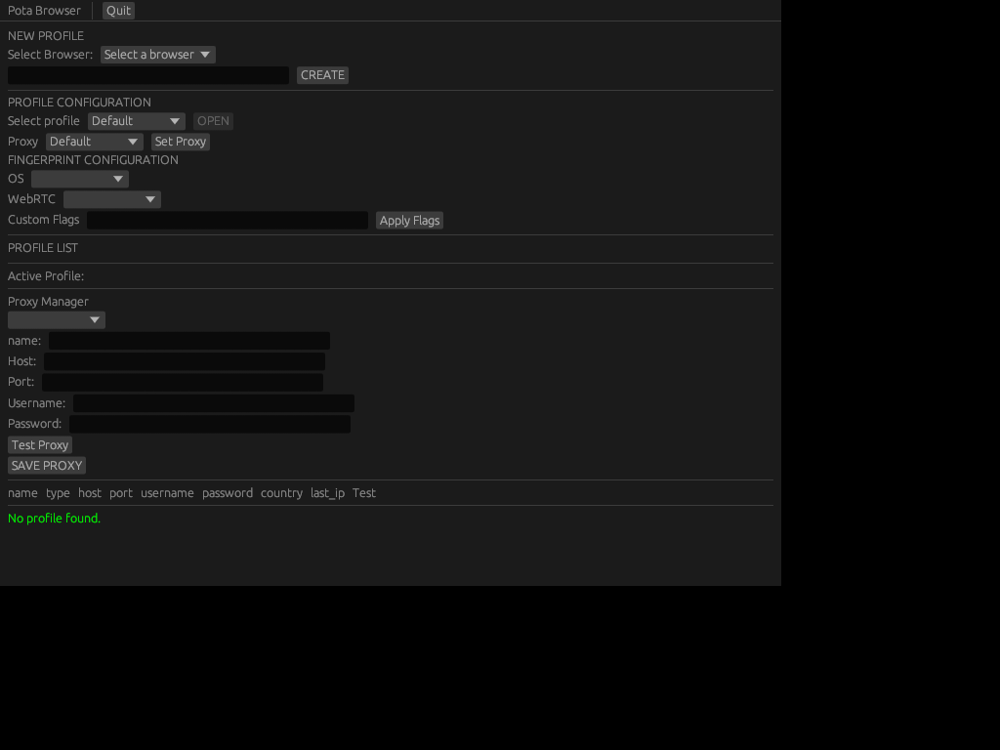

# Pota Browser

Hello! This is a **very early alpha** version of a hypothetical profile manager and anti-detection browser written in Rust. It's completely open-source and experimental.

The aim is to use the standard browser installation and tweak it in order to avoid fingerprint restriction and bypass antibot.

At the moment only Chromium based browser are supported.

## 🚧 Still a Work in Progress!

I’m actively developing Pota Browser, and there’s still a lot to do. If you’re curious, feel free to check out the repo, test it out, and let me know what you think. **Bug reports, feature ideas, and contributions are more than welcome!!** 🙌


## Join

- **IRC:** [irc.libera.chat #potabrowser](https://web.libera.chat/#potabrowser)  

## Read about

- [https://github.com/snaberino/pota-browser/blob/master/docs/Spoofing%20things.md](Spoo)
- [[Usefull chromium args]]
## Usage

### Requirements

- **Chromium based browser** 
- **Rust** 
### Installation & Usage

1. Clone the repository:
```
git clone https://github.com/snaberino/pota-browser.git
```
2. Navigate to the cloned folder: 
```
cd pota-browser
``` 
1. Run the project:
```
cargo run
``` 

## Proxy Handling

Currently, proxy support is implemented by passing the `--proxy-server` argument to Chrome, which only accepts the `host:port` format. To handle authentication, username and password injection is done via Chrome DevTools Protocol (CDP).

This is first proxy implementation and in future may change.

## TODO

- [ ] WebRTC **fake** spoofing (correctly spoof host & STUN IP).  
- [ ] Spoofing all `navigator` properties (device, OS, hardware, browser, etc.).  
- [ ] Screen size, resolution, window, and viewport property spoofing.  
- [ ] Managing multiple CDP sessions.
- [ ] Many other things. 

## References

1. https://chebrowser.site/doc/en/profiles.html#webrtc-settings
2. https://github.com/daijro/camoufox
3. https://github.com/MiddleSchoolStudent/BotBrowser